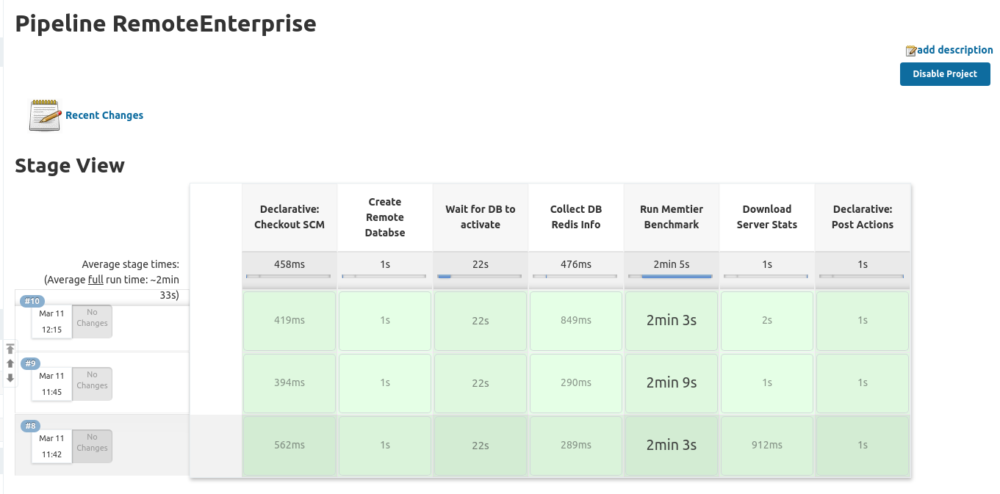

## Redis Enterprise and Jenkins 

<small>Presented by [Chris Mague](mailto:christian@redislabs.com)</small>

---

## Jenkins

The leading open source automation server, Jenkins provides hundreds of plugins to support building, deploying and automating any project.

---

## Competition

- Cloudbees (hosted Jenkins)
- CircleCI
- Drone
- Github Actions
- Gitlab

---

### Pipelines 

---

### Pipelines as Code

<pre><code>
pipeline {

    stages {
        stage("Autoconf"){
            steps{ sh 'autoreconf -ivf' } } }
        stage("Configure"){
            steps{ sh './configure' } } }
        stage("Test"){
            steps{ sh 'make test' } } 
    }

    post { always { sh './cleanup-script.sh' } }    
}
</code></pre>

---

### Redis Enterprise Examples
#### Run a local docker container

<small>
https://github.com/Redislabs-Solution-Architects/CI-Pipelines-Enterprise-Example/blob/local_docker/Jenkinsfile
</small>

---

### Redis Enterprise Examples
#### Run a local docker container

<small>
https://github.com/Redislabs-Solution-Architects/CI-Pipelines-Enterprise-Example/blob/memtier_against_host/Jenkinsfile
</small>

---

### Examples for scripted API calls

<small>
https://github.com/maguec/vagrant-jenkins/tree/master/tools   

|Script | Use Case |
|--|--|
|mkdb-byname.py|Create a database on a Redis Enterprise cluster|
|rmdb-byname.py|Delete a database on a Redis Enterprise cluster|
|dbstats-byname.py|Fetch Redis Enterprise Database performance data and store as CSV file|
| | |

</small>

---

## Demo Time
